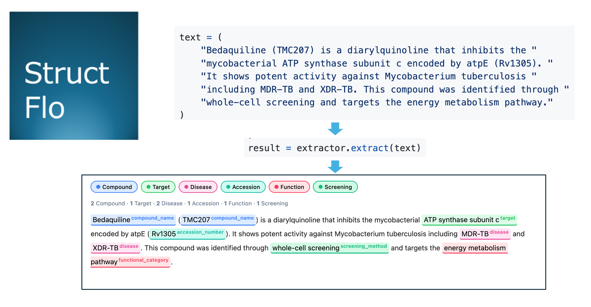
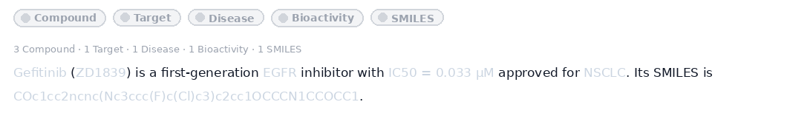
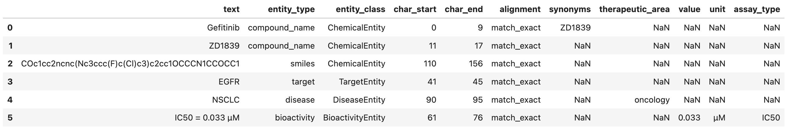
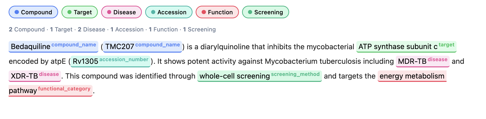
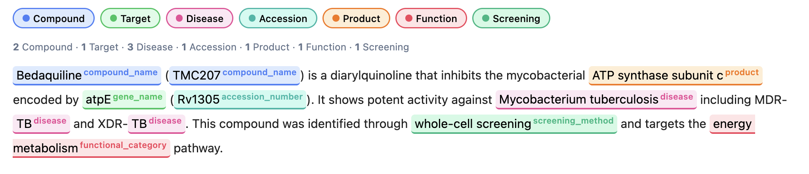

<h1 align="center">structflo.ner</h1>
<p align="center">
  
</p>

<p align="center">
<a href="https://pepy.tech/projects/structflo-ner"></a>
  <a href="https://github.com/structflo/structflo-ner/actions"></a>
  <a href="https://codecov.io/gh/structflo/structflo-ner"></a>
  <a href="https://github.com/structflo/structflo-ner/blob/main/LICENSE"></a>
  <a href="https://www.linkedin.com/in/sidxz/"></a>
  <a href="https://github.com/sidxz/"></a>
</p>

<p align="center">
  Zero-config Named Entity Recognition for drug discovery, chemistry, and biological sciences.
</p>


<p align="center">
  <a href="#installation">Installation</a> &bull;
  <a href="#llm-powered-extraction">LLM Extraction</a> &bull;
  <a href="#fast-dictionary-based-ner">Fast NER</a> &bull;
  <a href="#profiles">Profiles</a> &bull;
  <a href="#visualization">Visualization</a> &bull;
  <a href="#notebooks">Notebooks</a>
</p>

---

**structflo.ner** is a lightweight NER library specialized for pharmaceutical and biological sciences. It uses [LangExtract](https://github.com/google/langextract) and fuzzy based tools to deliver **zero-configuration** entity extraction.

It ships with two extraction engines:

|                   | `NERExtractor`                | `FastNERExtractor`                 |
| ----------------- | ----------------------------- | ---------------------------------- |
| Approach          | LLM-powered (Gemini, Ollama)  | Dictionary-based (YAML gazetteers) |
| Speed             | ~10-60s per abstract          | ~0.4-1s per abstract               |
| Novel entities    | Discovers new entities        | Known terms only                   |
| Context awareness | Full contextual understanding | String matching (exact + fuzzy)    |
| Cost              | API costs or local GPU        | Free (no API calls)                |
| Setup             | API key or Ollama             | Zero config                        |
| Output format     | `NERResult`                   | `NERResult` (identical)            |

## Installation

```bash
pip install structflo-ner
```

```bash
# or with uv
uv add structflo-ner
```

Install optional extras as needed:

```bash
pip install "structflo-ner[dataframe]"   # pandas DataFrame support
pip install "structflo-ner[fast]"         # fast dictionary-based NER (rapidfuzz)
```

## LLM-Powered Extraction

### Cloud model (Gemini)

The default model is `gemini-2.5-flash`. Pass your API key or set the `GEMINI_API_KEY` environment variable.

```python
from structflo.ner import NERExtractor

extractor = NERExtractor(api_key="YOUR_GEMINI_KEY")

result = extractor.extract(
    "Gefitinib (ZD1839) is a first-generation EGFR tyrosine kinase inhibitor "
    "with IC50 = 0.033 µM, approved for non-small cell lung cancer (NSCLC). "
    "Its SMILES is COc1cc2ncnc(Nc3ccc(F)c(Cl)c3)c2cc1OCCCN1CCOCC1."
)
```

### Local models via Ollama

Run extraction entirely on your own hardware — no API key needed:

```python
extractor = NERExtractor(
    model_id="qwen2.5:72b",
    model_url="http://localhost:11434",
    )
text = ("Gefitinib (ZD1839) is a first-generation EGFR inhibitor with IC50 = 0.033 µM approved for NSCLC."
        "Its SMILES is COc1cc2ncnc(Nc3ccc(F)c(Cl)c3)c2cc1OCCCN1CCOCC1.")
result = extractor.extract(text)
result
```
Any model served by [Ollama](https://ollama.com/) works  gemma, llama, mistral, qwen, deepseek, etc.


Render results as color-coded, interactive HTML directly in Jupyter notebooks:



To get a PANDAS dataframe.
```python
result.to_dataframe()
```



### TB specific extractor pass in the profile=TB
```python
from structflo.ner import NERExtractor, TB

extractor = NERExtractor(
    model_id="qwen2.5:72b",
    model_url="http://localhost:11434",
    profile=TB,
    
```
```python
text = (
    "Bedaquiline (TMC207) is a diarylquinoline that inhibits the "
    "mycobacterial ATP synthase subunit c encoded by atpE (Rv1305). "
    "It shows potent activity against Mycobacterium tuberculosis "
    "including MDR-TB and XDR-TB. This compound was identified through "
    "whole-cell screening and targets the energy metabolism pathway."
)
result = extractor.extract(text)
result
```



```python
# Flat list of all entities
for entity in result.all_entities():
    print(f"{entity.entity_type:20s} | {entity.text}")
```
```
compound_name        | Bedaquiline
compound_name        | TMC207
target               | ATP synthase subunit c
disease              | MDR-TB
disease              | XDR-TB
accession_number     | Rv1305
functional_category  | energy metabolism pathway
screening_method     | whole-cell screening
```

### Batch extraction

Pass a list of texts to extract from multiple documents at once:

```python
texts = [
    "Imatinib inhibits BCR-ABL with IC50 = 0.6 µM in CML.",
    "Trastuzumab targets HER2 in breast cancer patients.",
    "Remdesivir (GS-5734) is an antiviral with EC50 = 0.77 µM against SARS-CoV-2.",
]

results = extractor.extract(texts)
```

```
--- Text 1 ---
  compound_name        | Imatinib
  target               | BCR-ABL
  disease              | CML
  bioactivity          | IC50 = 0.6 µM

--- Text 2 ---
  compound_name        | Trastuzumab
  target               | HER2
  disease              | breast cancer

--- Text 3 ---
  compound_name        | Remdesivir
  compound_name        | GS-5734
  disease              | SARS-CoV-2
  bioactivity          | EC50 = 0.77 µM
```

## Fast Dictionary-Based NER (Mode 2)

`FastNERExtractor` uses curated YAML gazetteers with a three-phase matching strategy for deterministic, high-speed extraction when LLMs are not available.
These run extremely fast, however they are fuzzy based matches to predefined patterns and so it does not understands context.
```python
from structflo.ner.fast import FastNERExtractor

fast = FastNERExtractor()

text = (
    "Bedaquiline (TMC207) is a diarylquinoline that inhibits the "
    "mycobacterial ATP synthase subunit c encoded by atpE (Rv1305). "
    "It shows potent activity against Mycobacterium tuberculosis "
    "including MDR-TB and XDR-TB. This compound was identified through "
    "whole-cell screening and targets the energy metabolism pathway."
)

result = fast.extract(text)
result
```



### How matching works

| Phase | Method             | What it catches                                                                                           |
| ----- | ------------------ | --------------------------------------------------------------------------------------------------------- |
| 1     | **Exact match**    | Case-sensitive and normalized dictionary lookups with word-boundary enforcement                           |
| 1b    | **Regex patterns** | Auto-derived patterns from accession number seeds (Rv tags, UniProt, PDB, etc.)                           |
| 2     | **Fuzzy match**    | Typos and minor variants via [rapidfuzz](https://github.com/rapidfuzz/rapidfuzz) (configurable threshold) |

```python
# Fuzzy matching catches typos
result = fast.extract("Bedaquilne showed activity against TB")
# "Bedaquilne" -> canonical: "Bedaquiline" (method: fuzzy)

# Disable fuzzy matching for strict mode
strict = FastNERExtractor(fuzzy_threshold=0)
```

### Built-in gazetteers

The fast extractor ships with curated gazetteers for TB drug discovery:

| Gazetteer             | Examples                                       |
| --------------------- | ---------------------------------------------- |
| `accession_number`    | Rv1305, B586_RS00005                           |
| `gene_name`           | atpE, InhA, DprE1                              |
| `screening_method`    | whole-cell screening, fragment-based screening |
| `target`              | InhA, DprE1, MmpL3                             |
| `compound_name`       | Bedaquiline, Delamanid, Pretomanid             |
| `functional_category` | DNA replication, cell wall biosynthesis        |
| `strain`              | M. tuberculosis H37Rv                          |
| `product`             | enoyl-ACP reductase, ATP synthase subunit c    |
| `disease`             | TB, MDR-TB, XDR-TB                             |

### Custom gazetteers

Extend the built-in dictionaries with your own terms:

```python
custom = FastNERExtractor(
    extra_gazetteers={
        "target": ["MyNovelTarget", "KinaseX"],
        "compound_name": ["CompoundABC"],
    }
)
```

Or drop a new YAML file into the gazetteers directory — the filename (without `.yml`) maps to an entity type.

### Performance

```
Single abstract:  ~393 ms
8 abstracts:      ~862 ms
```

## Profiles

Profiles control which entity types are extracted. Use them to focus the model on specific categories.

### Built-in profiles

| Profile          | Entity classes                                                                                                  |
| ---------------- | --------------------------------------------------------------------------------------------------------------- |
| `FULL` (default) | compounds, targets, diseases, bioactivities, assays, mechanisms                                                 |
| `CHEMISTRY`      | compound names, SMILES, CAS numbers, molecular formulas                                                         |
| `BIOLOGY`        | targets, gene names, protein names                                                                              |
| `BIOACTIVITY`    | bioactivity measurements, assays                                                                                |
| `DISEASE`        | diseases and clinical indications                                                                               |
| `TB`             | TB drug discovery (compounds, targets, diseases, accessions, strains, screening methods, functional categories) |

```python
from structflo.ner import NERExtractor, CHEMISTRY

extractor = NERExtractor(api_key="YOUR_GEMINI_KEY")
result = extractor.extract(text, profile=CHEMISTRY)
```

### Merging profiles

Combine multiple profiles for broader extraction:

```python
from structflo.ner import CHEMISTRY, BIOLOGY

combined = CHEMISTRY.merge(BIOLOGY)
result = extractor.extract(text, profile=combined)
# Profile: chemistry+biology
# Entity classes: compound_name, smiles, cas_number, molecular_formula, target, gene_name, protein_name
```

### Custom profiles

Define your own extraction schema:

```python
from structflo.ner import NERExtractor, EntityProfile

my_profile = EntityProfile(
    name="kinase_inhibitors",
    entity_classes=["compound_name", "smiles", "target", "bioactivity"],
    prompt="Extract kinase inhibitor names, SMILES, targets, and potency values.",
    examples=my_examples,
)
result = extractor.extract(text, profile=my_profile)
```

## Working with Results

Both extractors return identical `NERResult` objects:

```python
# Typed entity lists
result.compounds        # [ChemicalEntity(...)]
result.targets          # [TargetEntity(...)]
result.diseases         # [DiseaseEntity(...)]
result.bioactivities    # [BioactivityEntity(...)]
result.assays           # [...]
result.mechanisms       # [...]
result.accessions       # [AccessionEntity(...)]

# Flat list of all entities
result.all_entities()

# Export to pandas DataFrame
df = result.to_dataframe()

# Serialize to dict (JSON-friendly)
result.to_dict()
```


## Notebooks

Explore worked examples in the [`notebooks/`](notebooks/) directory:

| Notebook                                             | Description                                                                     |
| ---------------------------------------------------- | ------------------------------------------------------------------------------- |
| [01_quickstart.ipynb](notebooks/01_quickstart.ipynb) | End-to-end extraction with cloud and local models, profiles, batch extraction   |
| [02_fast_ner.ipynb](notebooks/02_fast_ner.ipynb)     | Fast dictionary-based NER — matching strategies, custom gazetteers, performance |

## Contributing

Pull requests are welcome. For major changes, please open an issue first to discuss what you would like to change.

```bash
# clone and install dev dependencies
git clone https://github.com/structflo/structflo-ner.git
cd structflo-ner
pip install -e ".[dataframe]" --group dev

# run tests
pytest

# lint
ruff check .
ruff format .
```

## Citation

If you use structflo.ner in your research, please cite:

<details>
<summary>BibTeX</summary>

```bibtex
@software{structflo_ner,
  title  = {structflo.ner: Zero-config NER for Drug Discovery},
  url    = {https://github.com/structflo/structflo-ner},
  year   = {2026}
}
```

</details>

## License

This project is licensed under the [Apache License 2.0](LICENSE).
